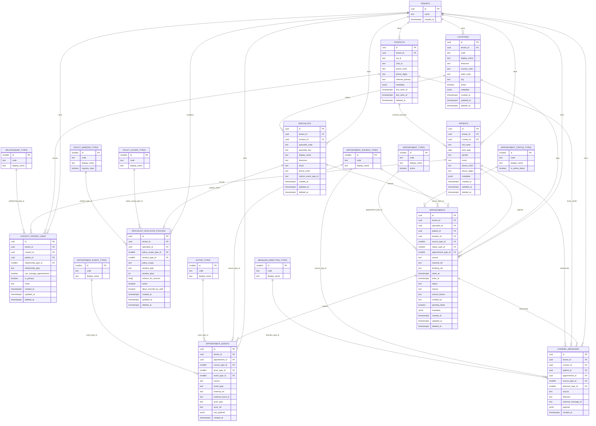
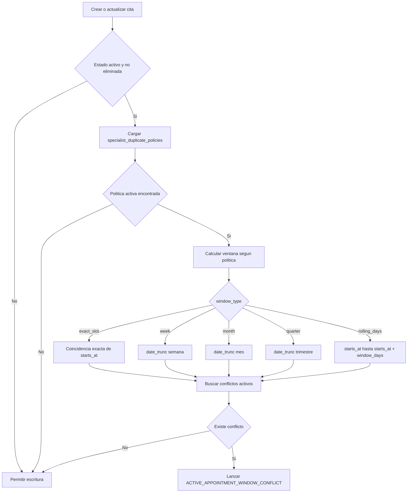

# Diagrama ER Omnicanal (PostgreSQL)

Este diagrama refleja lo que acabamos de implementar en `002_omnichannel_model.sql`, incluyendo:

- modelo entidad-relación principal,
- políticas de bloqueo de citas activas por ventana de tiempo,
- auditoría de eventos.

## 1) Modelo entidad-relación principal (con atributos y catálogos)

## 2) Lógica de bloqueo por periodo (semana/mes/trimestre/X días)

## 3) Reglas clave implementadas

- Unicidad técnica por `booking_uid` (cuando existe).
- Guard de duplicado exacto para citas activas.
- Política configurable por doctor:
  - `exact_slot`
  - `week`
  - `month`
  - `quarter`
  - `rolling_days`
- Alcance de política:
  - `same_specialist`
  - `all_specialists`
- Soft delete con `deleted_at`.
- Auditoría inmutable en `appointment_events`.

