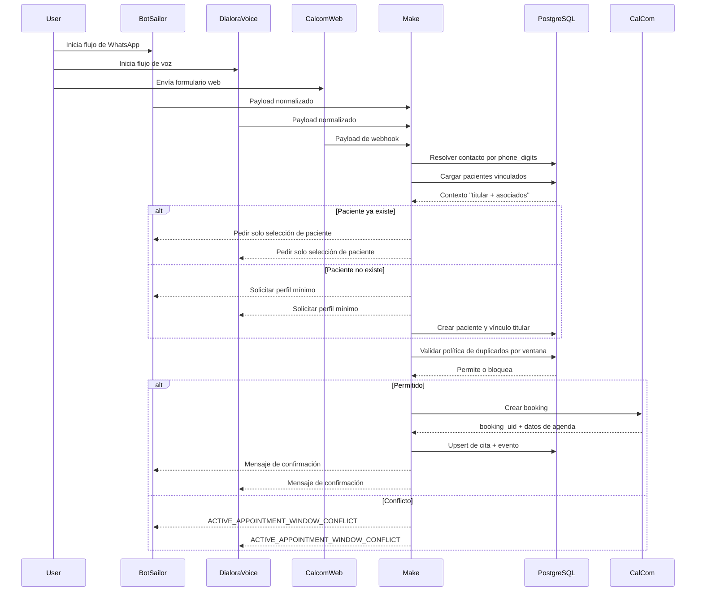
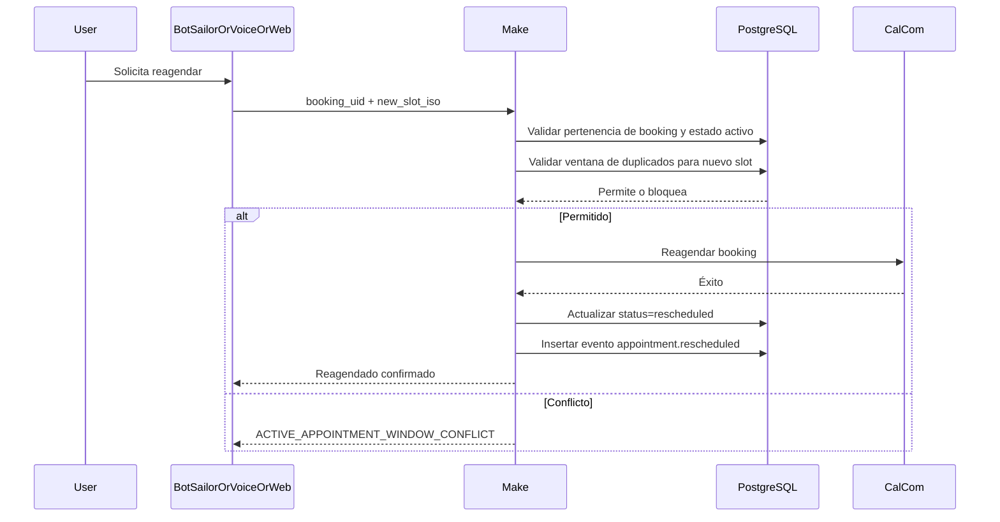
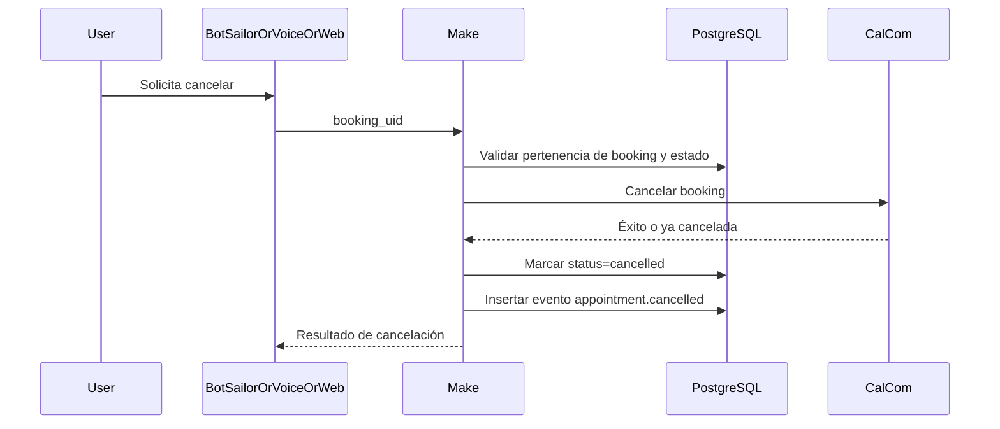
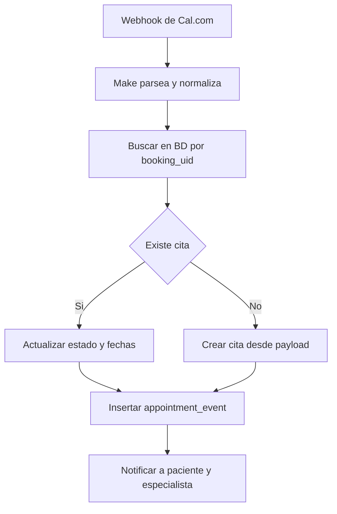
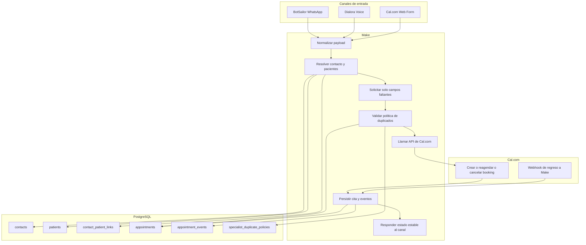

# Orquestación de Flujos Omnicanal (BotSailor + Make + PostgreSQL + Cal.com + Voz + Web)

Esta guía define cómo participa cada sistema en cada flujo de negocio.

## Objetivo

- Dejar de depender de validaciones frágiles en Sheets para detectar titular.
- Resolver pacientes y familiares con el modelo relacional (`contacts`, `patients`, `contact_patient_links`).
- Evitar pedir datos demográficos repetidos en cada cita.

## Estrategia base de resolución (reemplaza variable de titular en Sheets)

Usar este orden para toda interacción entrante:

1. Normalize phone (`phone_digits`) from WhatsApp/voice/web input.
2. Find-or-create `contacts` by `(tenant_id, phone_digits)`.
3. Load linked patients through `contact_patient_links`.
4. If at least one patient exists:
   - ask "who is this appointment for?" only when needed,
   - reuse saved demographics from `patients`.
5. If no patient exists:
   - collect minimum profile once and create patient + titular link.

Con esto, la detección de existencia es determinística e independiente del formato de filas en Sheets.

## Política de reutilización de datos (no pedir lo mismo cada vez)

Para titular y asociados:

- Reuse from DB when present:
  - `full_name`
  - `birth_date`
  - `gender`
  - último `reason` conocido (como sugerencia, no obligatorio)
- Pedir solo campos faltantes.
- Si el usuario dice "igual que la última vez", conservar valores previos.
- Actualizar perfil de forma incremental con datos confirmados por el usuario.

## Flujo A: Agendado de cita

Responsabilidades:

- BotSailor/Voz/Web: capturar inputs conversacionales/formulario.
- Make: orquestación, validación, mapeo y reintentos.
- BD: resolución de identidad, regla de duplicados por ventana, persistencia.
- Cal.com: motor de slots y booking.

## Flujo B: Reagendar

## Flujo C: Cancelar

## Flujo D: Eventos originados en calendario (panel doctor / web calendar)

## Qué hace cada sistema

- Input flow de BotSailor:
  - capturar intención y campos mínimos,
  - no decidir existencia con variables de Sheets,
  - siempre llamar a Make para resolver identidad.

- Flujo de voz Dialora:
  - mismo contrato que BotSailor,
  - usar modo "paciente conocido" cuando Make devuelva coincidencias.

- Cal.com web:
  - mantener campos requeridos del formulario,
  - enviar webhook a Make,
  - Make siempre persiste/mergea en BD.

- Make:
  - orquestador central,
  - transforma payload de canal a payload canónico,
  - llama funciones/vistas de BD antes de escribir en Cal.com,
  - devuelve códigos de estado estables.

- PostgreSQL:
  - fuente única de verdad para contactos/pacientes/vínculos/citas/eventos,
  - aplica ventanas de duplicado por política de especialista,
  - conserva auditoría completa.

## Contrato mínimo de payload por operación

- Agendar:
  - `tenant_id`, `source_type_id`, `specialist_code`, `phone_digits`, `slot_iso`
  - campos opcionales reutilizables: `full_name`, `birth_date`, `gender`, `reason`
- Reagendar:
  - `tenant_id`, `booking_uid`, `slot_iso`
- Cancelar:
  - `tenant_id`, `booking_uid`

## Despliegue recomendado

1. Mantener flujos actuales, pero enrutar primero validaciones de identidad a BD.
2. Habilitar prompts de reutilización de perfil ("es para usted o para un asociado?").
3. Retirar gradualmente filtros de existencia basados en Sheets.
4. Mantener Sheets solo como espejo de reporting durante transición.

## Paso a paso mapeado a escenarios actuales

Esta sección aterriza la implementación en tus nombres de escenario actuales.

### A) WhatsApp create appointment (`CONFIRMACION_CITA.blueprint.json`)

1. **BotSailor input flow**
   - Enviar a Make: `numero`, `especialista`, `slot_iso`, y campos opcionales.
   - No decidir existencia de paciente con variables de Sheets.
2. **Make step 1: normalize + resolve identity**
   - Normalizar `numero` -> `phone_digits`.
   - Buscar contacto en BD por `(tenant_id, phone_digits)`.
   - Buscar pacientes vinculados.
3. **Make step 2: patient selection logic**
   - Si hay un paciente vinculado, reutilizar directo.
   - Si hay varios, pedir selección (titular o asociado).
   - Si no hay, pedir perfil mínimo y crear paciente + vínculo (`relationship_type_id=1`).
4. **Make step 3: missing data only**
   - Pedir solo `full_name`, `birth_date`, `gender` faltantes.
   - Reutilizar perfil previo para pacientes conocidos.
5. **Make step 4: duplicate-window validation**
   - Validar duplicado exacto y ventana de política antes del booking.
6. **Make step 5: create in Cal.com**
   - Si permite, crear booking y capturar `booking_uid`.
7. **Make step 6: persist in DB**
   - Upsert appointment with `source_type_id=1`, `status_type_id=1`.
   - Insert `appointment_event` (`event_type_id=1`).
8. **BotSailor response**
   - Confirmación o conflicto (`ACTIVE_APPOINTMENT_WINDOW_CONFLICT`).

### B) Voice create appointment (Dialora tools + Make webhook)

1. **Dialora**
   - Mantener captura de especialista/día/slot como hoy.
   - Enviar el mismo contrato canónico que WhatsApp.
2. **Make**
   - Reutilizar exactamente el mismo pipeline de identidad y datos.
3. **DB**
   - Persist with `source_type_id=2`.
4. **Result**
   - Si el paciente ya existe, no se vuelven a pedir datos demográficos.

### C) Web create appointment (Cal.com web form + webhook)

1. **Cal.com form**
   - Mantener campos requeridos (phone/email/reason/birth_date).
2. **Make webhook (`DR. Cal.com...`, `DRA. Cal.com...`)**
   - Normalizar teléfono y resolver/crear contacto + paciente.
   - Vincular como titular si es primera vez.
3. **DB**
   - Upsert de cita por `booking_uid` (`source_type_id=3`).
   - Insert/merge de bitácora de eventos.
4. **Cross-channel consistency**
   - WhatsApp/Voz consultan el mismo contexto desde BD.

### D) Reschedule (`Reagendar_Cita.blueprint.json`)

1. **BotSailor/Voice/Web**
   - Enviar `booking_uid` + nuevo `slot_iso`.
2. **Make prechecks**
   - Validar que booking pertenece al tenant y esté activa.
   - Validar ventana de duplicados para el nuevo slot.
3. **Cal.com**
   - Llamar endpoint de reagendado.
4. **DB**
   - Actualizar cita a `status_type_id=3` (`rescheduled`).
   - Insertar evento `appointment.rescheduled`.
5. **Channel reply**
   - Confirmación o conflicto/error.

### E) Cancel (`Cancelar_Cita.blueprint.json`)

1. **BotSailor/Voice/Web**
   - Enviar `booking_uid`.
2. **Make precheck**
   - Si no hay `booking_uid`, devolver `MISSING_BOOKING_UID`.
3. **Cal.com**
   - Llamar endpoint de cancelación.
4. **DB**
   - Marcar `status_type_id=4` (`cancelled`).
   - Insertar evento `appointment.cancelled`.
5. **Important**
   - Nunca hacer hard-delete de paciente/contacto/cita.

### F) Existing queries (`Consultar_Citas_Existentes`, `Consultar_Pacientes_Existentes`, `COMPROBACION_ES_PACIENTE`)

1. **Replace Sheets-first logic**
   - Consultar primero BD por `phone_digits`.
2. **Return deterministic payload**
   - Devolver lista vacía cuando no hay datos, nunca objeto con nulls ambiguos.
3. **Patient existence**
   - Existe si el contacto tiene al menos un paciente vinculado.
4. **Titular logic**
   - Leer de `contact_patient_links.relationship_type_id=1`, no de variable en Sheet.

## Matriz de ejecución por sistema (quién hace qué)

- **BotSailor / Dialora / Formularios Web**
  - Capturan intención y entradas del usuario.
  - Preguntan seguimiento solo si Make indica campos faltantes.
- **Make**
  - Orquesta todas las decisiones de negocio.
  - Llama a BD para identidad, validación de duplicados y persistencia.
  - Llama a Cal.com solo si pasan prechecks en BD.
- **PostgreSQL**
  - Fuente única de verdad para identidad y citas.
  - Aplica políticas de duplicado por especialista.
  - Guarda trazabilidad de auditoría/eventos.
- **Cal.com**
  - Motor de slots y bookings.
  - Envía webhooks de vuelta a Make para sincronización.

## Diagrama end-to-end con fronteras por sistema

